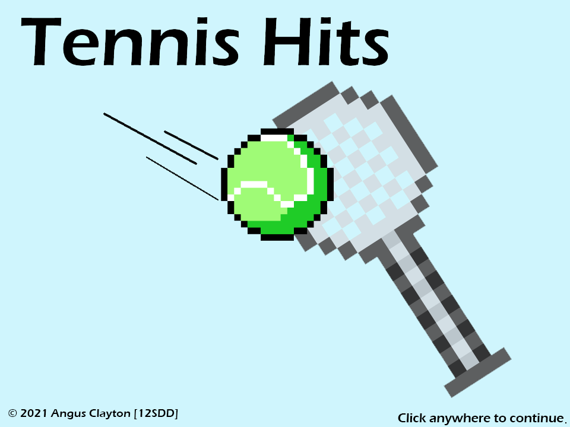

# Tennis Hits

A game by *Angus Clayton* for the YR12 SDD course. 

Created in pygame; tested on `Python 3.7.9 `

See [log.md](log.md) for development log.

## User Feedback
#### Good:
* Simple Menu Interaction
* Well designed menus
* Minimal bugs in actual gameplay
* Clean Interface
* Well-executed idea

#### Improvements:
* Blackball/Tennis racket hit-box is bigger than sprite image
* No end screen, game just closes
* No pause menu
* No indicator for lost points/gained points
* No obvious indicator that gold ball does not slow down time
* Red ball spawning on tennis racquet causes lost points without giving user enough time to react (consider adding a countdown)
* Sounds/Music would be cool
