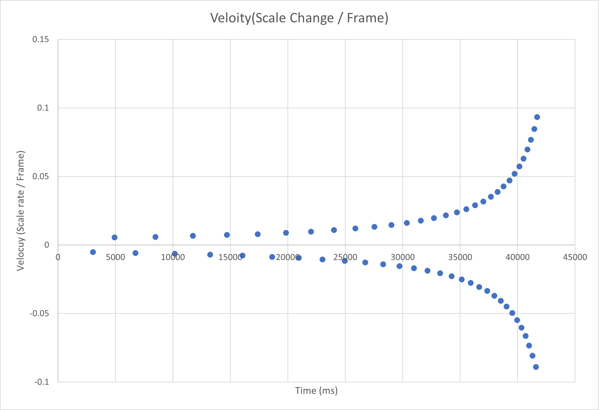

# Stack overflow article helped with the Z scaling
https://stackoverflow.com/questions/43046376/how-to-change-an-image-size-in-pygame

# Useful website on adding text to pygame
https://pythonprogramming.net/displaying-text-pygame-screen/

## Game Idea 1

# 16/5/2021

Developing game ideas; currently thinking of 'endless' scroller game. 

Decided on a game where player has to dodge objects, some objects are useful and player should collide with.

player dodges objects by 'flipping gravity'


At this stage game needs:

- Title Screen
- Collision detection
  - which should reduce health of player by enemy.damage amount.
  - enemy then should despawn
  - sound effect?


## Game Idea 2
Decided that the gravity flip game was too basic; so have decided to make a tennis game.
There will be four balls:

The *main ball* the player must hit every time; if it goes past the player (i.e. z position is > 1) then the game ends.


The *main ball* must be hit at the right time (when the ball is green, not when the ball is red).
    When ball green and hit; player is awarded 1 point
    When ball red and hit; player does not get point for hitting ball. 
        This feature is to stop the player from holding mouse over ball; making the game harder as there is the timing component.
        It is not intended to make the player loose the game from lack of points.

The *purple ball* gives the player 5 points when hit; compared to the main balls single point (but you must still hit the main ball)


The *yellow ball* slows down time (in practise by decreasing the Z velocity by a positive scalar < 1). This effect is never reversed, and reliez on the z velocity being multiplied when impacted by the players and the computers racket.


The *grey ball* end the game when the user touches it; it is sort of a 'bomb' ball.


### Features added as of 30/5/2021:
Completed the game design.
Completed the game graphics.
Implemented the main ball code, player racket and help/start sequence.

## 31/5/2021

Implemented the specialty balls.

The purple and grey balls are quite self explanatory in documentation above.

The time ball works by reducing the Z velocity of the ball to 75% of its original value.  This allows the player to have more time to get the timing on the main ball correct.


In the **above graph** you can see the the time bomb slows down the rate Z velocity. Unlike in the **graph below** where no time bombs were used, and the game becomes 'impossible' after 40,000ms. 

***NOTE: Negative values represent when the ball is heading away from player (negative velocity);  The magnitude is what is important*** 



These graphs were developed utilizing this piece of code; placed around the `while gameFinished == False:` line of code.

```python
prevV = 0 #FOR DATA ANALYSIS OF THE Z VELOCITY OF MAINBALL
while gameFinished == False: #main loop; change gameFinished when game is exited to True
    if mainBall.vz != prevV: #only output change in velocity. Don't need those extra data points; as just forms straight lines.
        print(pygame.time.get_ticks(),mainBall.vz)
        prevV = mainBall.vz
```

For testing purposes; the balls were initially triggered by key presses; but are now triggered at random;

#### Testing Code:

```python
        if True: #Change to false when not debuging the specialty balls
            if event.type == pygame.KEYUP:
                if event.key == pygame.K_d:
                    deathBall = objects.deathBall()
                    activeSpecialBalls["DEATH"] = True
                    ballObjects.add(deathBall)
                if event.key == pygame.K_b:
                    bonusBall = objects.bonusBall()
                    activeSpecialBalls["BONUS"] = True
                    ballObjects.add(bonusBall)
                if event.key == pygame.K_t:
                    timeBall = objects.timeBall()
                    activeSpecialBalls["TIME"] = True
                    ballObjects.add(timeBall)
```

####  Final Game Code:

```python
#need to also ensure that other ball of same type does not already exist on screen
            if toSpawn == 1 and activeSpecialBalls["DEATH"] == False:
                deathBall = objects.deathBall()
                activeSpecialBalls["DEATH"] = True
                ballObjects.add(deathBall)
            if toSpawn == 2 and activeSpecialBalls["BONUS"] == False:
                bonusBall = objects.bonusBall()
                activeSpecialBalls["BONUS"] = True
                ballObjects.add(bonusBall)
            if toSpawn == 3 and activeSpecialBalls["TIME"] == False:
                timeBall = objects.timeBall()
                activeSpecialBalls["TIME"] = True
                ballObjects.add(timeBall)
```

## To Do [As of 31/5/21]

- Add end screen
- Add high score database
- Finalise documentation
- Improve help screen looks
- Add 'tooltips' when user dies; telling them why and what they can do to improve

# 11/6/2021 [2.5 hrs]

## Font choice:

**ERAS DEMI ITC** for static text as of 11/6/2021; pygame dynamic text is all <u>Free and open sans</u>


## Adding High Score Functionality:

Used a json file to score high scores:

https://www.programiz.com/python-programming/json *helpful article on json use in python.*

Created a highscore.py file; containing easy to use functions to interface with high score db file.


## Game over screen

Added game over screen, has two 'screens'; one for when you get beat high score, and one when you don't:

#### Game Over New high score:

***Note: the dark blue box is a text input field.***


 

#### Game Over Regular


## To Do: As of 11/6/21

- Finish Game over screen.
  - Make the exit button exit; and save button save high score
- Finalise documentation
- Improve help screen looks
- Add 'tooltips' when user dies; telling them why and what they can do to improve

# 12/5/2021

#### Added help message.

Help message appears when the user 'dies'; informing them how to do better next-time.

#### Finalized game over screen.

Exit buttons work; high score information displaying correctly.

Made pygame text fonts **ERASBD.ttf** to match static text.

#### Change in Active Specialty balls. 

From user feedback; found that if you leave racket in middle; it will hit the specialty balls before user had time to register they were there. Now made it so that specialty ball z has to be greater than 10%.

